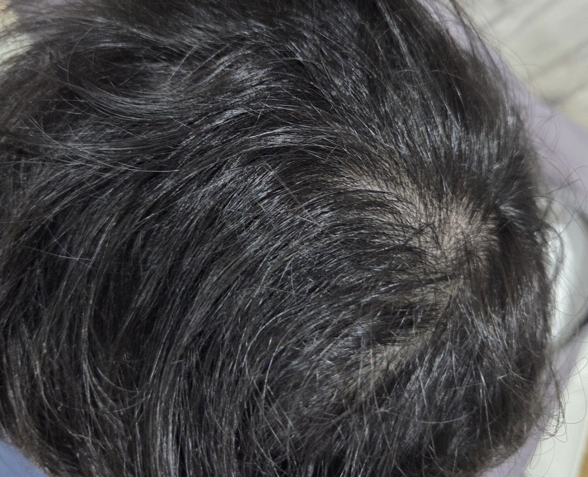

+++
author = "chanyo"
title = "chanyoのAGAとの激闘録 第0章"
date = "2025-11-13"
description = "AGA治療の経過を報告していくシリーズ"

categories = [
    "雑談"
]
tags = [
    "AGA"
]
+++
こんにちは。chanyoです。  
一応、このブログの名前には、｢エンジニア｣と入っているのですが、一発目の記事が、**まさかの、AGA。**   
このブログは最初からクライマックスだぜ！ 
最初に言っておく　俺はかーなーりハゲてる！ 
泣けるでぇ
   
申し訳ありません。享楽のクソ台ライダー達が参戦してしまいました。
僕はこのハゲジン達に憑依されることで、仮面ライダー禿王に変身することが可能なのですが、代わりに毛髪を失ってしまいました。
  
毛髪を失うメカニズムについては、AGAという病名がついているようです。
このブログでは、chanyoのAGAとの激闘録と題しまして、私の頭部の進捗状況を定期的に投稿しようと思います。
   
まず、最初にAGAとその対策としては、以下のYouTuberの方の動画を見れば良いと思います。私からこれ以上の事は何も言えません。
  



  
ただ、AGA界隈には悩めるハゲをカモにして法外な価格の治療プランを押し付け、ハゲの毛髪どころかケツ毛まで毟りとろうとする、血も涙もない悪魔も存在するらしいので気をつけてください。
   
そして、私が実践している治療法は以下です。

* フィナステリド(フィンペシア) 1日0.5mg 朝に服用
* 塗りミノキシジル(リアップx5) 1日2回　朝と夜に外用(ただ朝は面倒で80%の確率でサボります)  

それぞれの薬品の購入方法とコストですが、フィンペシアは[こちら](https://www.idrugstore.jp/product/318567)から購入しています。0.5mgずつの服用にすれば、1錠で2日分となるため、かなり低価格で使っていけることになります。 

リアップx5は、僕の父が熱心に毎日塗りたくっており、実家にたくさんの在庫があるため、それを盗んでいます。 ですので僕は無料ということになるのですが、ちゃんと購入すると結構割高ですね。 1本あたり6000円ほどが相場でしょうか。 僕の場合は1本で大体2ヵ月くらい使えます。 
塗りミノも、後々個人輸入に切り替えようかなとも思っています。
   
さて、すみませんね、前置きが長くなりましたが、初回ですのでお許しください。
では、今現在の私の頭部状況を公開します。心臓の弱い方はこの先十分注意してお読みください。
      

  
画像の通り、僕のプレイスタイルは、M字HAGEです。両翼がピッチのサイドを切り裂き、敵を相手陣内に釘付けにします。
  

  
頭頂部は、サイドレーンよりはまだ耐えているかなと思っていますが、いつ焼け野原にされるか分かりませんので、こちらの写真も投稿していこうと思います。
   
では、第0章はここまでにします。
この世のハゲに、幸あらんことを。
