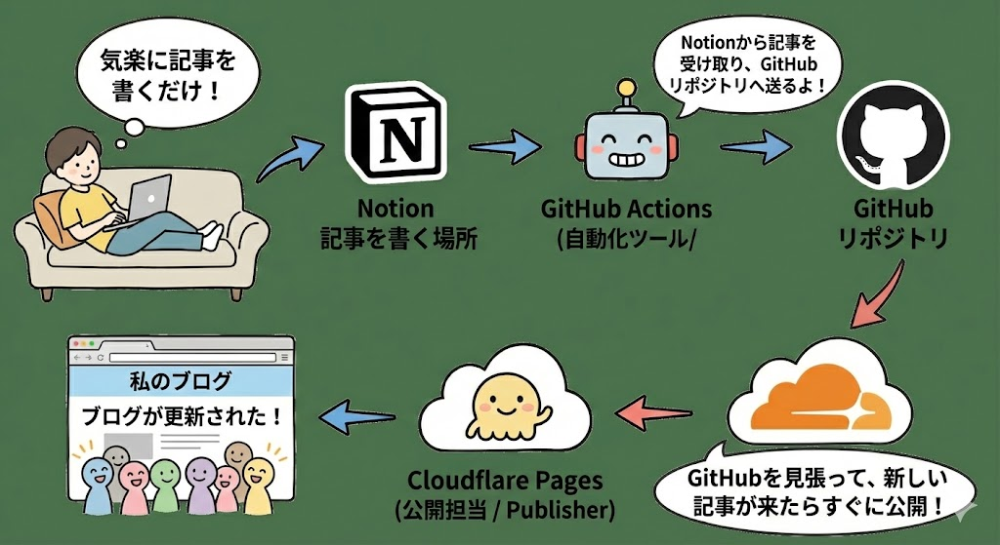
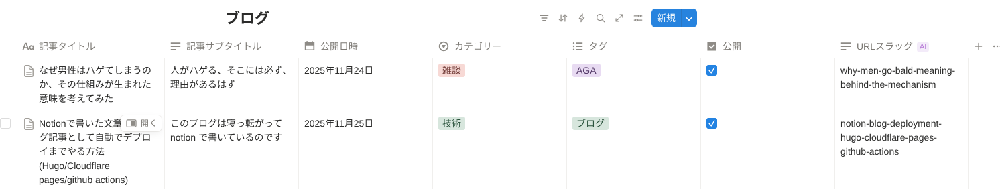

+++
author = "chanyo"
title = "Notionで書いた文章をブログ記事として自動でデプロイまでやる方法(Hugo/Cloudflare pages/github actions)"
date = "2025-11-25"
description = "このブログは寝っ転がってnotion で書いているのです"
slug = "notion-blog-deployment-hugo-cloudflare-pages-github-actions" 

categories = [
    "技術"
]
tags = [
    "ブログ"
]
+++

## Hugo+Cloudflare Pagesでブログ運営

私のこのブログ、サイトのデザインはイケてるでしょ。

まあ、肝心の中身が微妙なのは置いとくとして。

 

それもそのはず。このサイトはですね、hugoとかいう物を使って、色々用意されているテンプレートから選んでいるだけなのです。

 

で、ブログの運営費用もね、ドメイン料金だけで、後は一銭もかかっていません。

ドメイン料金といっても、このブログの.jpだと、初年度は350円、それ以降は3500円くらいが年間かかりますが、それだけ払えば良いということですわ。

 

この構成、めっちゃオススメですよ。

やり方は、もうね、すごい人たちの記事がたくさんあります。

[HugoとCloudFlare Pagesでブログ公開](https://shirakamo-lab.com/post/blog_hugo_cloudflare_pages/)

[Hugo × Cloudflareで簡単ブログ構築](https://zenn.dev/seita1996/articles/hugo-markdown-blog)

とか。他にも色んな方が書いてくれてます。僕の出る幕はありません。

 

で、これ最初は色々と環境構築が必要ですけど、一回やっちゃえば、マークダウンという普通に文章書くのとあまり変わらない形式で文章を作り、後は簡単なコマンドをちょっと打ってgithubに記事を反映させれば、自動でサイトが更新されるようになります。

めっちゃ楽。いいねこれ。

 

 

## Notionに記事を書き、そのままブログに投稿する方法

上記の仕組みめっちゃ良かったのですが、僕みたいな弱エンジニアは、パソコンとかあまり開きたくないんですよね。プライベートで。

 

なんなら僕は家ではもうずっと寝っ転がってスマホをいじくり倒している狂人なので、パソコンを取りに行く、ちゃんと座る、パソコンを開く、この一連の動作に必要な気力、体力は相当なものです。

 

だから、私のようなスマホ依存症患者でもブログを書けるような環境を作りました。

 

ざっくり構成としては以下のようになります。（ナノバナナってすごいよね。）

Notionに記事を書けば、それがブログ記事として公開される仕組みです。なぜNotionなのかというと、たまたま私が使った事があったからです。見出しとか太字とか画像貼り付けとか、そういったブログに必要な文章をNotionは書きやすいと感じています。スマホでも。

 

ただ、厳密には、Github Actionsも手動で実行する運用をしているのですが、これはスマホのウィジェットを1タップすれば良いので、全然面倒じゃないです。むしろ、手動実行のほうが、ミスや事故なく公開できるので良いなと今は思っています。

 

 

これを実現するのに、必要なステップはざっくり以下です。

1. Cloudflare PagesとGithubを連携し、Hugoを使ってサイトページを生成、自動デプロイできるようにする。（[この記事の前半](/2b51195a2299808ba389f2f15bcdecf5#2b61195a2299802ba011d9c2cc299d3b)で紹介した記事などで完了する範囲。）
2. Notionに記事を格納するためのデータベースを準備する。
3. Notionからデータベース内の情報をAPIで読み込めるように準備する。
4. Notionから記事データを読み取り、加工処理を施した上で、ブログ用Githubリポジトリを更新するプログラムを作成する。
5. 4のプログラムをGithub Actionsに設定し、スマホから実行できるようにする。

 

簡単に紹介しようと思います。（ステップ1は割愛します。）

### Notionに記事を格納するためのデータベースを準備する

データベースの作り方は色々ネットに上がっていますが、例えばこれなど。
[https://seleck.cc/1456](https://seleck.cc/1456)

 

で、このデータベースをブログ記事管理用にプロパティを設定します。私の場合はこうなっています。

 

