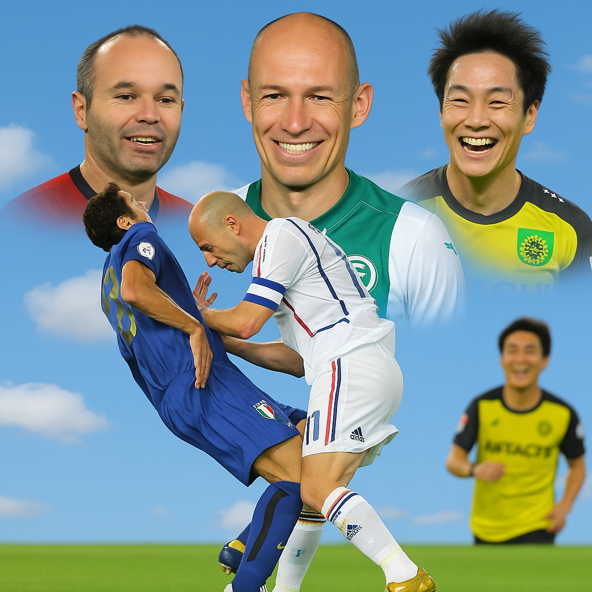

+++
author = "chanyo"
title = "なぜ男性はハゲてしまうのか、その仕組みが生まれた意味を考えてみた"
date = "2025-11-24"
description = "人がハゲる、そこには必ず、理由があるはず"
slug = "why-men-go-bald-meaning-behind-the-mechanism" 

categories = [
    "雑談"
]
tags = [
    "AGA"
]
+++

こんにちは。chanyoです。

 

人間って良くできてると思いませんか？

 

人間の体ってね、全ての設計に意味があると思うんですよ。

僕がこの思想を持つに至ったのは高校生の時なんですが、保健体育の授業でですね、先生がキンタマの話をしてくれたんですよ。

> ｢精子は、睾丸に入っています。精子は熱に弱いので、なるべく冷えるように、袋でぶら下げて外に出しています。また、睾丸は大切なので、2つあります。｣

こんなことを説明してくれました。

僕はそれまで、なんでキンタマが2つあるのかとか、なんでキンタマ袋が股間にぶら下がっているのだろうか、とか、考えたこともありませんでした。

 

当時は15歳かそこらだと思いますが、まあキンタマ達とは生まれたときからずっと一緒にやってきた訳ですから、特に理由なんか考えませんよね。

 

でも、キンタマがすごく大切にされていて、あいつは予備まで作られた上に袋に入れられてぶら下げられるという特別対応をされる程の存在なんだと思うと、なんか、僕も誇らしい気持ちになりました。

 

 

まあ、この話は僕の中で強烈に印象に残っていましてね、社内SEになってからというもの、冗長化だの災対環境だのRAIDだのといった言葉を耳にしては、｢ああ、キンタマのパクリね。｣と、思っています。

 

 

なんかね、カッコいい言葉をつけていますけれども、なにかあったときの為にバックアップを用意するという考えはですね、とっくの昔にキンタマがやってたんですね。

 

もし、僕がRAID1の発明者だったら、RAID金と名付けていたと思います。パッケージキャラクターはホウオウです。

いや、このキンタマ話から何が言いたいのかというとですね、**人間の体の設計は、必ず、そうなっている意味がある**ということです。

 

進化論的に言うと、キンタマが一つしかない生物よりも、キンタマが二つある生物の方が有利だから、今地球上にはキンタマが二つある生物が生き残り繁栄しているのです。

 

他の体の部位も同様に、地球上で生き残るのに有利である要素が、ふんだんに詰め込まれ洗練されているわけです。

 

ということは、です。最近僕に牙を向いてきた、AGA。

 

これも、何か意味がないとおかしいのです。

 

僕たちハゲの民は、何も前世で悪の限りを尽くしたから罰としてハゲ散らかしているのでは断じて無いと。ハゲには、必ず、何か合理的な理由がないとおかしいのです。

 

 

ってことでね、じゃあその理由って何だよってところを考えてみました。

 

まずは、前提から考えましょう。なぜ、人は髪の毛が生えているのでしょうか。

 

これはね、簡単ですね。

毛っていうものは人体で特に重要とされる部位に生えると聞いたことがあります。

まずは股間。また股間の話かよってね。僕に文句を言われても困りますけども。

まあ股間というものは人体にとっては本当に大切なんだなという事が伝わるほど、生えますよね、股間には。

 

ただ、｢あぶねー！おれのチンチン、今危うく致命傷を負いそうだったけど、毛が生えていたおかけで免れたよー！｣という経験は一度もありませんが。

 

それでも、気休めでもいいから股間の守備を固めておきたいってのが人体側の想いでしょうか。

他にも色々と毛が生える部所はありますけれども、全て大事な部分です。
当然、髪の毛も、同じです。髪の毛が生えている部分には、大切な脳がありますから。

よって、｢髪の毛が生えている人間は、脳を守ろうとしている。｣この命題が真ということになります。

 

 

では対偶をとるとどうなるでしょうか。

こうなります。

 

｢脳を守る気が無い人間は、髪の毛が生えていない。｣

 

元の命題が真なので、これも真となります。

 

つまり、脳を守る気が、体側の意思として皆無である人間は、皆ハゲているわけです。

ただし、裏が真とは限らない事に注意してください。

どういうことかと言うと、

 

｢髪の毛が生えていない人間は、脳を守る気がない。｣

 

これは真であるかどうかは分かりません。

脳を守る気はあるけれど、ハゲている人は存在するかもしれないのです。

 

 

けれど、ここからの議論では、そのようなハゲは無視することとします。

 

なぜならば、脳を守りたいのにハゲている、そんな人はもはや私の手に負えないからです。

 

もう、ハゲている事が趣味なのだとしか思えません。趣味でハゲている人の事まで考えると、議論がカオスすぎてとてもまとまりませんので。

 

よって、次の命題も真であるということにします。

 

｢髪の毛が生えていない人間は、脳を守る気がない。｣

 

これには、私自身、大変驚きました。

 

私も髪の毛が生えていない人間(まだ完全体ではなくとも、それを体が目指している人間)の一人となりますが、脳を守る気が、体側に、無かったとは。

 

衝撃のあまり、この記事を発表するかどうか、迷いました。でも、誰も読んでないからセーフという判断に至りました。

 

さあ、議論は、クライマックスを迎えました。

 

｢脳を守る気がないから、ハゲる。｣

 

この結論を得ただけでも、以前に比べてAGAに対する理解が相当に深まったと言えるでしょう。

 

 

ただ、僕はもう少し深掘りしたい。

 

｢なぜ、ハゲている人は、脳を守る気がないのだろう？｣

 

朝風呂に入りながら小20分間考え込みましたが、答えは見つからず、この問いは現代医学をもってして、まだ説明するのが不可能な領域にあるのかとも思いました。

 

 

しかしそこで、ふと僕はある一つの光景を思い出しました。

 

2006年　W杯　決勝戦。

 

当時、僕は小学生で、サッカー部に所属していたので、早朝でしたが、テレビで見ていたのを覚えています。

この決勝戦の試合内容ははっきりいって全く覚えていないのですが、全世界のサッカーファンに衝撃を与える事件がありました。

そう、｢[ジダン頭突き事件](https://ja.wikipedia.org/wiki/%E3%82%B8%E3%83%80%E3%83%B3%E9%A0%AD%E7%AA%81%E3%81%8D%E4%BA%8B%E4%BB%B6)｣です。

事件の詳細な経緯などは、Wikipediaの記載に譲りますが、僕は、

｢マテラッツィは過剰に痛がりすぎだ。頭突きがそんなに痛いわけがあるか。ジダンを退場に追い込むための演技だ。｣

と、思っていました。

 

この時の記憶が、僕の中に、今甦り、バラバラだったピースが一つになろうとしている。

ハゲ。

頭突き。

頭を守る。

痛そうなマテラッツィ。

ぶちギレているジダン。

足が速すぎるロッベン。

最高のMFイニエスタ。

柏さん今年は好調ですね 小屋松。

 

 

 

 

｢・・・守られていたのは、世界の方だったんだ。｣

 

あなたが誰かに殴られたとき、あなたが拳から受けた力と同じだけの力を、相手の拳もあなたから受けています。

作用反作用の法則です。

 

<u>髪の毛は、脳のある頭部を守るために生えている。</u>

これは、あくまで人体目線での書き方です。

外から見ると、こうなります。

<u>髪の毛は、脳のある頭部から受ける力を軽減してくれている。</u>

 

そうなんです。

マテラッツィは、痛がっているふりをしているわけではなかった。

本当に痛かったんだ。

 

ジダンのヘアスタイルを思い出してください。

そこに衝撃を和らげるクッションはありません。

純度100%の衝撃を、ジダンの頭突きはマテラッツィに与えていた。

｢マテラッツィを｣守ってくれる髪の毛が、なかったからです。

 

髪の毛によって守られていたのは、自分自身ではなく、周囲の世界の方でした。

髪の毛がなくなり、ノーガードになったのは、自分自身ではなく、周囲の世界の方でした。

 

ハゲにとって、頭とは、第三の拳。

もちろん俺らは抵抗するで？拳で！

なぜ、男性はハゲてしまうのか。

その仕組みが生まれた意味。

それは、不条理で、理不尽なこの世界に、抵抗するための拳を、粛々と磨き続ける覚悟の表れ。

 

だから、ハゲは、俺達は、孤独な世界でも、戦い続けられる。

僕は、そう思います。

